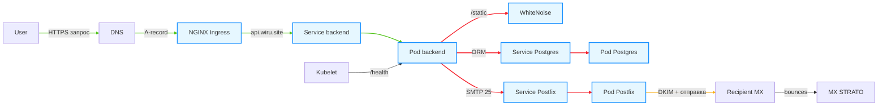

```mermaid
graph LR
  %% main
  U[User] -->|HTTPS запрос| DNS[DNS]
  DNS -->|A-record| ING[NGINX Ingress]
  ING -->|api.wiru.site| SVC_BE[Service backend]
  SVC_BE --> POD_BE[Pod backend]
  POD_BE -->|/static| WN[WhiteNoise]
  POD_BE -->|ORM| SVC_PG[Service Postgres]
  SVC_PG --> PG[Pod Postgres]
  
  %% email syystem
  POD_BE -->|SMTP 25| SVC_PF[Service Postfix]
  SVC_PF --> PF[Pod Postfix]
  PF -->|DKIM + отправка| MX[Recipient MX]
  MX -->|bounces| STRATO[MX STRATO]
  
  %% healthcheck
  KUBE[Kubelet] -->|/health| POD_BE
  
  %% group  Kubernetes
  classDef k8s fill:#e6f7ff,stroke:#1890ff,stroke-width:2px;
  class ING,SVC_BE,POD_BE,WN,SVC_PG,PG,SVC_PF,PF k8s;
  
  %% legend
  linkStyle 0,1,2,3 stroke:#52c41a,stroke-width:2px;
  linkStyle 4,5,6,7,8 stroke:#f5222d,stroke-width:2px;
  linkStyle 9 stroke:#faad14,stroke-width:2px;
```

